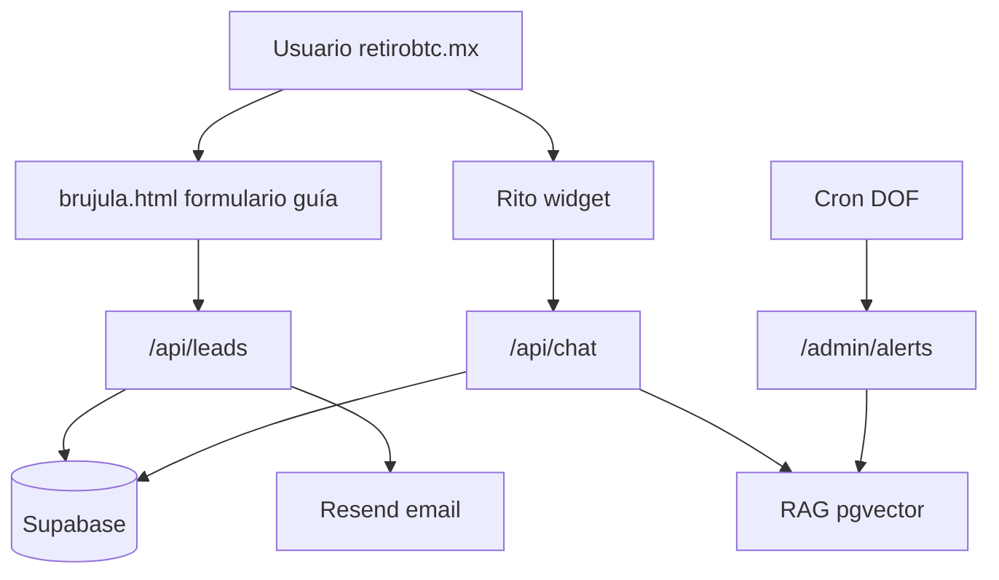

# Arquitectura — Ecosistema de Agentes IA retirobtc.mx

> Vertical 1 implementada. Verticales 2 (Growth) y 3 (Back-Office) planificadas para fases posteriores.

## Organigrama

### Vertical 1 — Front-Office (MVP ✅)

| Agente | Implementación |
|--------|----------------|
| **Rito** | Chat streaming Gemini Flash + RAG pgvector. Widget en landing, calc, brújula. |
| **Captura leads** | `POST /api/leads` desde formulario guía `/brujula`. Resend + token guía PDF. |
| **Investigador jurídico** | Cron diario DOF RSS → `legal_alerts` → revisión humana → ingest KB. |

### Vertical 1.5 — Pendiente

- Agente Generador de Contenido (TikTok/X/SEO) alimentado por alertas aprobadas.

### Vertical 2 — Pendiente

- Prospección/calificación de leads (scoring brújula + calc)
- Ventas e-commerce (requiere tienda cold wallets)

### Vertical 3 — Pendiente

- Contabilidad multi-moneda (MXN + sats)
- Facturación CFDI

## Diagrama de flujo (MVP)

## Stack

| Capa | Tecnología |
|------|------------|
| Front | HTML/JS estático (repo raíz) — **sin migrar a Next.js** |
| Agentes | Next.js 16 App Router, TypeScript, Vercel AI SDK |
| LLM | Gemini 2.0 Flash (chat), OpenAI text-embedding-3-small (RAG) |
| DB | Supabase Postgres + pgvector |
| Email | Resend |
| Deploy | Dos proyectos Vercel: raíz + `agents/` |

## Archivos clave

| Ruta | Rol |
|------|-----|
| [`agents/app/api/chat/route.ts`](../agents/app/api/chat/route.ts) | Rito streaming |
| [`agents/app/api/leads/route.ts`](../agents/app/api/leads/route.ts) | Captura leads |
| [`agents/lib/agents/rito.ts`](../agents/lib/agents/rito.ts) | System prompt |
| [`agents/lib/rag/`](../agents/lib/rag/) | Chunking, embeddings, búsqueda |
| [`agents/public/widget/rito.js`](../agents/public/widget/rito.js) | Widget embed |
| [`agents-config.js`](../agents-config.js) | URL del servicio (prod vs local) |
| [`rito-loader.js`](../rito-loader.js) | Carga dinámica del widget |
| [`brujula-quiz.js`](../brujula-quiz.js) | Integración leads API |

## Política Rito

- Tono empático, institucional, pedagógico.
- **No** asesoría fiscal/legal vinculante — disclaimer en cada sesión.
- **No** procesar PII financiera ni datos de pago.
- RAG obligatorio para temas legales; alertas DOF solo tras aprobación humana.
- Escalamiento: `calculadora.retirobtc@gmail.com`.

## Privacidad (INAI)

- Consentimiento registrado en `consent_records` con versión de aviso (`2026-05`).
- IP almacenada como hash SHA-256.
- Mensajes de chat redactados (emails/números).
- Retención chat: 90 días (configurable en Supabase policies).

## Variables de entorno

Ver [`agents/.env.example`](../agents/.env.example).

## KPIs Vertical 1

1. Conversión brújula → lead válido
2. P95 primera respuesta Rito &lt; 3 s
3. % conversaciones sin escalamiento humano
4. Tiempo alerta legal → KB indexada

## Próximos pasos operativos

1. Crear proyecto Supabase y ejecutar `schema.sql`
2. Desplegar `agents/` en Vercel con subdominio `agents.retirobtc.mx`
3. Configurar Resend con dominio verificado
4. Seed KB desde admin
5. Reemplazar placeholder PDF en `agents/public/guia-retiro-mexico.pdf`
