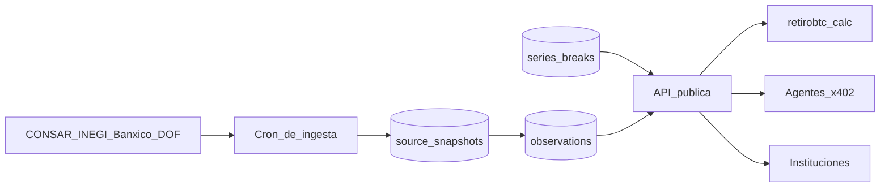

# Fase 2 — Datos de pensiones México (sub-marca neutral)

> Línea de negocio **nueva**, no una fase del roadmap agéntico. Software puro, sin datos personales.
> Producto actual: [`product-brief.md`](./product-brief.md) · Roadmap de ingresos: [`roadmap-agentico-ingresos.md`](./roadmap-agentico-ingresos.md)
> Versión: 2026-08 · Estado: **diseño**, sin código.

---

## 1. Qué se vende y qué no

**Se vende:** datos públicos del sistema de ahorro para el retiro, normalizados, versionados, cruzados entre fuentes y citables.

**No se vende, nunca:** nada de `leads`, `chat_messages`, `purchases` ni proyecciones de un usuario identificable. El [aviso de privacidad](../aviso-privacidad.html) dice que los datos personales no se venden ni se transfieren, y eso no se toca. Esta fase no necesita datos de usuario para existir.

Si algún día se quisiera publicar un índice agregado a partir del uso de la calculadora, sería otro proyecto: exige opt-in explícito, nuevo aviso de privacidad, umbral mínimo por celda y cero texto libre. Fuera de alcance aquí.

---

## 2. El problema con la idea obvia

La capa cruda **ya es gratis**:

- CONSAR publica SISET con series históricas exportables (CSV, XML, Excel): IRN de Siefores Generacionales, comisiones, traspasos, activo neto, cuentas registradas.
- Existe al menos un proyecto open source (**Datos México**) con API pública de CONSAR, incluyendo `GET /api/v1/consar/rendimientos/serie`.

Conclusión incómoda pero útil: "normalizo CONSAR y lo vendo" tiende a precio cero. El valor está una capa más arriba.

---

## 3. Dónde sí hay valor defendible

### a) Vintages (point-in-time)

El gobierno **sobreescribe**; nosotros archivamos. Y el histórico tiene quiebres que rompen cualquier backtest ingenuo:

| Quiebre | Fecha | Efecto |
|---------|-------|--------|
| Nuevo IRN en vigor | 1 jul 2022 (DOF 2 jun 2022) | **No comparable** con el IRN vigente hasta dic 2019 ni con el de Unidades de Pensión |
| Siefore Básica 95-99 inicia | 26 ago 2024 | Nueva serie sin historia |
| Siefore Básica 55-59 deja de operar | 26 ago 2024 | Serie truncada |

Ponderación del IRN vigente: 10 años pesa 50%, 5 años 30%, 3 años 20%.

Un consumidor que compare 2021 contra 2025 sin anotar esto publica un número falso. Vender la serie **con los quiebres marcados y con "cómo se veía el dato en la fecha X"** es el activo central.

**El moat es el tiempo.** Cada mes que no archivamos es un mes que no se recupera.

### b) El cruce entre fuentes

Una sola fuente es commodity. El rendimiento **real neto por generación** exige tres:

| Fuente | Qué aporta |
|--------|------------|
| CONSAR (SISET) | IRN, comisiones, activo neto, traspasos |
| INEGI | INPC (inflación), ENOE (informalidad), ENIGH |
| Banxico (SIE) | UDIS, tasas de referencia |
| IMSS | Salario base de cotización |
| DOF | Cambio normativo (ya lo monitoreamos) |

### c) Detección de cambios con trazabilidad

Ya corre el investigador jurídico sobre el DOF con [`LEGAL_KEYWORDS`](../agents/lib/config.ts) (AFORE, CNBV, pensiones, SAR, IMSS, ISSSTE, INFONAVIT, activos virtuales). Falta ligar *"esto cambió en el DOF"* con *"por eso este indicador se movió"*.

### d) Citabilidad

Las instituciones no pagan por el número: pagan por poder auditarlo. Cada respuesta lleva `as_of`, URL de la fuente, fecha de publicación oficial y hash del archivo descargado.

---

## 4. Sub-marca neutral (decisión tomada, nombre pendiente)

Ninguna AFORE ni consultora le compra datos a quien la usa de antagonista. La campaña «Tu AFORE Soberana» y el comparador AFORE vs Bitcoin son activismo de producto; el proveedor de datos tiene que ser **neutral, sin postura sobre Bitcoin**.

| Capa | Marca | Postura |
|------|-------|---------|
| Datos y API | **Sub-marca neutral** (nombre por definir) | Neutral, factual, citable |
| Calculadora / campaña | `retirobtc.mx` | Poder adquisitivo, BTC conservador |

`retirobtc.mx` pasa a ser **un cliente más** de la API, no su dueño visible.

**Pendiente de confirmar por el fundador:** nombre y dominio. Criterios: neutral, en español, sin "bitcoin" ni "cripto", sin sugerir organismo oficial (no usar "CONSAR", "SAR", "gob"). No se registra nada hasta que se elija.

Reglas de marca desde el día uno: citar fuente y fecha, **no** implicar aval de CONSAR ni de ninguna autoridad, **no** presentar el dato como asesoría de inversión.

---

## 5. Gama de productos

| # | Producto | Qué entrega | Comprador | Base ya existente |
|---|----------|-------------|-----------|-------------------|
| 1 | **Alertas normativas SAR** | DOF filtrado, resumen, impacto, fuente | Compliance fintech, despachos, medios | Sí: cron DOF + `legal_alerts` |
| 2 | **API de series vintaged** | IRN y comisiones `as_of` + quiebres | Consultoras, académicos, gestores | No |
| 3 | **Rendimiento real neto** | CONSAR × INPC por generación | Asesores, prensa, sindicatos | No |
| 4 | **Benchmark de comisiones** | Comparativo histórico | AFOREs, consultoras | No |
| 5 | **Reportes trimestrales** | PDF con narrativa y gráficas | Instituciones, medios | Parcial (PDF Premium) |

Orden de arranque: **1 y 3**. El 1 es la extensión más corta desde lo que ya corre; el 3 es aritmética sobre dos fuentes públicas y además arregla un problema propio (§7).

---

## 6. Esquema propuesto (vintages)

Esquema Postgres aparte del de agentes. Nombre tentativo `pensiones`. Nada de PII, así que RLS es menos crítica que en `retirobtc`, pero se activa igual y se otorga sólo a `service_role`.

```sql
-- Cada descarga cruda queda inmutable: es la prueba de auditoría.
create table if not exists source_snapshots (
  id uuid primary key default gen_random_uuid(),
  source text not null,              -- 'consar_siset', 'inegi_inpc', 'banxico_sie', 'dof'
  dataset text not null,             -- 'irn_generacionales', 'comisiones', ...
  source_url text not null,
  published_at date,                 -- fecha que declara la fuente
  fetched_at timestamptz not null default now(),
  content_hash text not null,        -- sha256 del archivo tal cual
  raw_bytes bigint,
  storage_path text,                 -- Supabase Storage
  constraint source_snapshots_hash_key unique (source, dataset, content_hash)
);

-- Observación normalizada. `snapshot_id` la ata a su vintage.
create table if not exists observations (
  id bigserial primary key,
  snapshot_id uuid not null references source_snapshots (id),
  series_key text not null,          -- 'irn.afore=profuturo.siefore=90-94.plazo=120m'
  period date not null,              -- mes de referencia
  value numeric(18, 6) not null,
  unit text not null,                -- 'pct_anual', 'mxn', 'cuentas'
  revision smallint not null default 1,
  constraint observations_vintage_key unique (series_key, period, snapshot_id)
);

-- Quiebres metodológicos: sin esto, la serie miente.
create table if not exists series_breaks (
  id uuid primary key default gen_random_uuid(),
  series_prefix text not null,       -- 'irn.'
  effective_from date not null,
  reason text not null,
  dof_url text,
  comparable_backwards boolean not null default false
);
```

Regla de diseño: **nunca se hace `UPDATE` sobre `observations`.** Un dato revisado entra como fila nueva atada a otro snapshot. Así `as_of` es una consulta, no una reconstrucción.



---

## 7. Endpoint piloto

`GET /api/data/afore/rendimiento-real?generacion=90-94&as_of=2026-06-30`

Devuelve IRN nominal, INPC del periodo, rendimiento real derivado, `as_of`, fuente citada y los quiebres aplicables.

Su primer consumidor somos nosotros. Hoy el dato está clavado en el código:

```12:14:script.js
  const SWR_RATE = 0.04;
  /** Rendimiento real histórico promedio del sistema AFORE (CONSAR, ~2026). */
  const AFORE_REAL_RATE = 0.0502;
```

Cuando el endpoint exista, ese `0.0502` se alimenta de la API y el comparador AFORE vs BTC deja de envejecer solo. Es la mejor prueba de que el dato sirve: si no nos sirve a nosotros, no le sirve a nadie.

---

## 8. Cobro: dos motores distintos

**x402 no le vende a instituciones.** Una AFORE o una consultora compra con contrato, orden de compra y CFDI; nadie en compras firma un pago en USDC por llamada.

| Motor | Comprador | Mecanismo | Ticket |
|-------|-----------|-----------|--------|
| **Autoservicio** | Agentes IA, devs | x402 (USDC en Base, facilitator Coinbase CDP) | $0.01–0.05 por consulta |
| **Contrato** | Instituciones | Suscripción anual, CFDI, licencia | El que importa |

El primero da tracción y reputación; el segundo, ingreso.

### x402 — notas técnicas

- Protocolo abierto bajo la x402 Foundation. El servidor no toca blockchain: un *facilitator* hace `/verify` y `/settle`.
- Coinbase CDP: gratis hasta 1,000 tx/mes, luego ~$0.001 por transacción. Es una **dependencia de proveedor**, aunque el spec permita correr el propio.
- Volumen del protocolo completo a ago 2026: ~163 M transacciones, ~$41 M USD liquidados. Ticket promedio de centavos. **No es el motor de ingresos de esta fase**; es distribución y posicionamiento.
- Cobrar en USDC implica tesorería en cripto y facturación en MXN: el dolor de P4 (CFDI) llega antes de lo planeado.

### Cambio necesario en P0

El esquema de compras hoy no admite un tercer rail:

```171:176:agents/supabase/schema.sql
  provider text not null check (provider in ('mercadopago', 'lightning')),
  external_id text not null,
  plan text not null check (plan in ('monthly', 'lifetime')),
  amount numeric(14, 2) not null check (amount >= 0),
  currency text not null check (currency in ('MXN', 'SAT')),
```

Migración cuando x402 entre: `provider` acepta `'x402'`, `currency` acepta `'USDC'`, y el concepto `plan` deja de aplicar (los agentes compran llamadas, no planes). `/api/admin/revenue` reporta un tercer bucket, sin sumar monedas distintas.

### Licencia

Suscripción con derecho de uso interno y de cita con atribución. **Prohibida la redistribución** y la reventa del dataset. Sin garantía de exactitud más allá de "as published": se entrega lo que publicó la fuente, con su hash y su fecha.

---

## 9. Legal

Datos públicos gubernamentales, reutilizables. Mucho más simple que el caso de datos de usuario:

- Citar fuente y fecha de publicación en cada respuesta.
- No implicar aval ni afiliación con CONSAR, IMSS, Banxico, INEGI o el gobierno.
- No presentar el dato como asesoría de inversión ni como proyección garantizada.
- Revisar los términos de uso de cada portal antes de ingerirlo.
- Sin datos personales: **no** aplica el trámite de LFPDPPP que sí aplicaría a un índice construido con uso de usuarios.

---

## 10. Riesgos

| Riesgo | Realidad | Mitigación |
|--------|----------|------------|
| La capa cruda es gratis | Cierto y ya existe API open source | Vender vintages, cruce y citabilidad, no el CSV |
| Venta institucional lenta | Ciclos de compra largos, sin historial nuestro | Empezar por medios y despachos; autoservicio primero |
| Conflicto de marca | Una AFORE no compra a un antagonista | Sub-marca neutral desde el día uno |
| Formato de la fuente cambia | CONSAR ya cambió metodología del IRN | Snapshots inmutables + `series_breaks` |
| x402 aún es pequeño | Ticket promedio de centavos | Tratarlo como distribución, no como ingreso |
| Exactitud | Un error en compliance cuesta caro | "As published" + hash + provenance en cada respuesta |

---

## 11. Siguientes pasos

1. **Elegir nombre y dominio** de la sub-marca. Bloquea el resto del branding.
2. **Empezar a archivar ya**: cron mensual que baje SISET y guarde `source_snapshots` con hash. Cuesta casi nada y el histórico perdido no se recupera.
3. **Validar demanda antes del catálogo**: tres conversaciones (consultoría de pensiones, prensa financiera, compliance fintech) preguntando qué dato les cuesta trabajo obtener hoy.
4. **Endpoint piloto** de rendimiento real neto, consumido por la propia calculadora.
5. **Alertas SAR** sobre el cron DOF que ya corre.
6. **x402 al final**, cuando haya endpoint que valga la pena pagar.

**Precedencia:** esta fase no arranca antes de que P1 traiga tráfico ni antes del primer cobro Premium real en `purchases`, que sigue pendiente. El paso 2 es la única excepción: archivar es urgente porque el dato se pierde.

---

*Fuentes consultadas 19 ago 2026: CONSAR SISET (publicación de estadísticas 15 jun 2026), proyecto open source Datos México, x402 Foundation y dashboards públicos de liquidación x402.*
