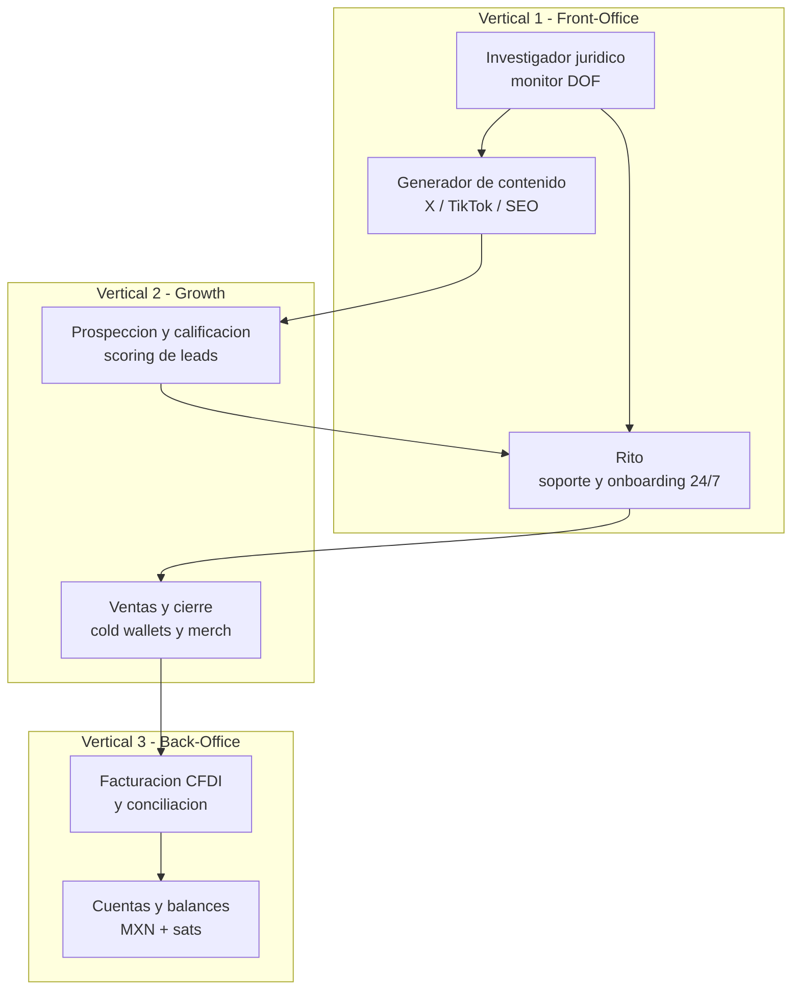
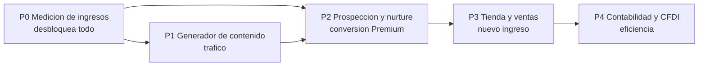
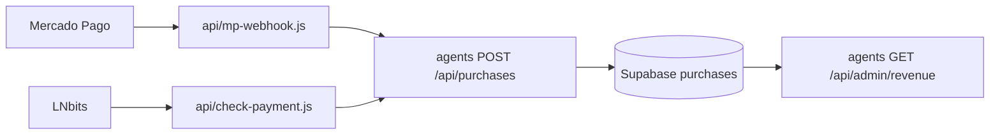

# Roadmap agéntico para ingresos automáticos — retirobtc.mx

> Prioriza el orden de construcción de la organización agéntica según impacto en ingresos.
> Arquitectura actual: [`agentes-ia-arquitectura.md`](./agentes-ia-arquitectura.md) · Producto: [`product-brief.md`](./product-brief.md) · Tono: [`guia-marca-tono-claude.md`](./guia-marca-tono-claude.md)
>
> Versión: 2026-08 · Sin cambios de código todavía: este documento define el orden, no la implementación.

---

## 1. Organigrama objetivo

El diseño no es un "superbot", sino agentes especializados conectados por flujos de trabajo.



**Embudo autónomo previsto:** descarga de guía → prospección califica → contenido nutre por correo → Rito resuelve dudas 24/7 → ventas ofrece la cold wallet adecuada → facturación timbra el CFDI y contabilidad consolida.

---

## 2. Estado real (agosto 2026)

### Implementado

| Agente | Vertical | Implementación |
|--------|----------|----------------|
| **Rito** | 1 | [`agents/app/api/chat/route.ts`](../agents/app/api/chat/route.ts) + RAG pgvector + widget en landing, calc y brújula |
| **Investigador jurídico** | 1 | [`agents/app/api/cron/legal-monitor/route.ts`](../agents/app/api/cron/legal-monitor/route.ts) → `legal_alerts` → revisión humana en `/admin/alerts` |
| **Captura de leads** | 1 | [`agents/app/api/leads/route.ts`](../agents/app/api/leads/route.ts) + Resend + token de guía |
| **Cobro Premium** | — | [`api/create-preference.js`](../api/create-preference.js) (MXN) y [`api/create-invoice.js`](../api/create-invoice.js) (Lightning) |

### Pendiente

| Agente | Vertical | Fase en este roadmap |
|--------|----------|----------------------|
| Generador de contenido | 1.5 | P1 |
| Prospección y calificación | 2a | P2 |
| Ventas e-commerce | 2b | P3 |
| Contabilidad multi-moneda | 3 | P4 |
| Facturación CFDI | 3 | P4 |

---

## 3. Hallazgo que reordena la prioridad

**El cobro funciona, pero el ingreso no se registra en ningún lado.**

[`api/mp-webhook.js`](../api/mp-webhook.js) recibe la notificación de Mercado Pago, escribe un log y responde 200:

```js
console.info('[mp-webhook]', { method: req.method, query, bodyType: typeof body });
return res.status(200).send('OK');
```

Los comentarios del propio archivo ya marcan la persistencia como evolución pendiente. En el lado Lightning, [`api/check-payment.js`](../api/check-payment.js) consulta LNbits y devuelve `{ paid }` sin guardar nada.

Además, [`api/create-preference.js`](../api/create-preference.js) usa `external_reference: plan`, es decir solo la cadena `monthly` o `lifetime`. No hay identificador de correlación que permita unir un pago con el lead que lo originó.

### Consecuencias

- No existe tabla `purchases` en [`agents/supabase/schema.sql`](../agents/supabase/schema.sql)
- El MRR no es medible sin entrar al panel de Mercado Pago
- No se puede calcular el valor de un lead ni el retorno de una campaña con UTM
- El agente contable de Vertical 3 no tendría fuente de datos propia
- El agente de prospección de Vertical 2 no podría entrenar su scoring contra conversiones reales

Por eso **la medición va antes que cualquier agente nuevo**: es el prerrequisito de P2, P3 y P4.

---

## 4. Prioridad por impacto en ingresos



| Fase | Impacto en ingresos | Superficie de cambio | Dependencia externa |
|------|---------------------|----------------------|---------------------|
| P0 ✅ | Indirecto: habilita medir todo lo demás | 1 tabla + 2 endpoints nuevos + 4 handlers de pago | Ninguna |
| P1 | Alto: tráfico al embudo | 1 agente + 1 tabla + 1 panel admin | API de Buffer |
| P2 | El más directo sobre Premium | 2 columnas + 1 agente + secuencia Resend | Ninguna |
| P3 | Abre ingreso nuevo | Catálogo, checkout, agente de ventas | Inventario, logística, proveedor |
| P4 | Nulo directo: reduce carga operativa | 2 agentes + integración PAC | PAC mexicano para timbrado |

---

## 5. P0 — Medición de ingresos y atribución (implementada)

**Objetivo:** que cada peso y cada sat quede registrado y atribuible a su origen.

**Estado:** código en el repo. Falta la activación operativa, documentada al final de esta sección.

### Esquema

Nueva tabla en [`agents/supabase/schema.sql`](../agents/supabase/schema.sql):

```sql
create table if not exists purchases (
  id uuid primary key default gen_random_uuid(),
  provider text not null check (provider in ('mercadopago', 'lightning')),
  external_id text not null,
  plan text not null check (plan in ('monthly', 'lifetime')),
  amount numeric not null,
  currency text not null,           -- MXN o SAT
  status text not null,             -- approved, pending, rejected
  correlation_id text,              -- une checkout con lead
  lead_id uuid references leads (id) on delete set null,
  utm jsonb,
  created_at timestamptz not null default now(),
  unique (provider, external_id)
);
```

El `unique (provider, external_id)` hace idempotente la escritura, y eso importa en los dos rails: Mercado Pago reintenta notificaciones, y el cliente sondea `check-payment` cada 3 segundos mientras espera el pago Lightning.

### Dónde vive la llave de Supabase

El proyecto raíz **no** habla directo con la base. La llave de servicio queda sólo en `agents/`, y la raíz reenvía la compra ya confirmada a `POST /api/purchases` autenticándose con `INTERNAL_API_SECRET`.



Cuesta un salto de red, pero evita duplicar la llave de servicio en un segundo proyecto de Vercel.

### Cambios en el flujo de pago

1. **Correlación.** [`script.js`](../script.js) genera un `correlation_id` estable por navegador y captura los UTM al iniciar, antes de que se limpien los parámetros de la URL. [`api/create-preference.js`](../api/create-preference.js) los manda a Mercado Pago en `external_reference` (`<plan>:<correlationId>`) y en `metadata`.
2. **Retrocompatibilidad.** [`api/_lib/plan.js`](../api/_lib/plan.js) acepta también el formato antiguo (`monthly` a secas), para no romper checkouts creados antes del despliegue.
3. **Mercado Pago.** [`api/mp-webhook.js`](../api/mp-webhook.js) reconsulta el pago por id con nuestro access token y registra la compra. Esa reconsulta es la que impide que un aviso forjado invente un cobro. La firma HMAC se valida **antes** de esa consulta, así una petición sin firma válida no cuesta una llamada a la API de Mercado Pago ni una escritura; en cualquier despliegue se falla cerrado si falta `MERCADOPAGO_WEBHOOK_SECRET`, y hay además un límite holgado de 60 peticiones por minuto por IP.
4. **Semántica de reintento.** El webhook responde 200 a lo que no hay que reintentar (avisos de otros recursos, pagos sin plan o moneda distinta de MXN) y 5xx sólo cuando un pago real no se pudo registrar. Así se evita un ciclo infinito de reintentos.
5. **Lightning.** El plan se marca en el memo de la factura **desde el servidor** ([`api/_lib/plan-memo.js`](../api/_lib/plan-memo.js)); al confirmar el pago, [`api/check-payment.js`](../api/check-payment.js) lo lee de LNbits junto con el importe. El cliente nunca declara qué plan compró.
6. **Redundancia.** [`api/verify-mp-payment.js`](../api/verify-mp-payment.js) también registra en el retorno del checkout, así la compra queda medida aunque la notificación no llegue.

### Qué es dato del cliente y qué no

El importe, el plan y el estado provienen siempre del proveedor de pago. Lo único que aporta el cliente es la atribución (`correlation_id` y UTM), que se sanea contra una lista blanca de claves y nunca influye en importes ni en el acceso a Premium.

### Reporte

`GET /api/admin/revenue?days=30` en [`agents/app/api/admin/revenue/route.ts`](../agents/app/api/admin/revenue/route.ts), autenticado con la cabecera `x-admin-secret` igual que el panel de alertas:

- MRR de suscripciones mensuales y desglose por plan
- Ingreso por canal: Mercado Pago frente a Lightning
- Conversión lead a Premium, más el número de compras sin atribuir
- Top de campañas por UTM

MXN y sats se reportan **por separado**. No guardamos el tipo de cambio del momento del cobro, así que sumarlos produciría un total falso.

La tasa de conversión es una aproximación, no una cohorte estricta: un lead captado antes de la ventana puede convertir dentro de ella. El endpoint lo documenta en su propia respuesta.

### Nota de privacidad

`purchases` no guarda correo, datos de tarjeta ni montos de ahorro del usuario, en línea con la política de Rito. El correo del pagador se usa en memoria sólo para resolver el `lead_id` y no se persiste. Se almacena únicamente el importe cobrado, el plan y la atribución.

### Activación operativa pendiente

El código está en el repo, pero la medición no arranca hasta:

1. Ejecutar [`agents/supabase/schema.sql`](../agents/supabase/schema.sql) en el SQL Editor de Supabase. Si los 2 cupos del plan gratuito ya están ocupados, no hace falta un proyecto nuevo: el encabezado del script explica cómo alojar las tablas en un esquema propio dentro de un proyecto existente, y luego se declara con `SUPABASE_DB_SCHEMA`
2. Generar un `INTERNAL_API_SECRET` de 24 caracteres o más y ponerlo **idéntico** en los dos proyectos de Vercel (raíz y `agents/`)
3. Definir `AGENTS_BASE_URL` en el proyecto raíz, apuntando a `https://agents.retirobtc.mx`
4. `MERCADOPAGO_WEBHOOK_SECRET` desde Dashboard de Mercado Pago → Webhooks. **Obligatorio en cualquier despliegue,** producción y preview por igual: sin él el webhook responde 503 y no registra cobros, porque quedaría sin autenticar y cada petición costaría una consulta a la API de Mercado Pago más una escritura. Las URL de preview son públicas y comparten variables con producción salvo que se acoten, así que ahí también se exige. Sólo se omite en local.

El script ya activa RLS sobre `purchases` y las demás tablas, y otorga privilegios sólo a `service_role`: es información financiera y de leads, y no debe quedar al alcance de la llave anónima.

Mientras falten las variables, los cobros siguen funcionando con normalidad y el registro simplemente se omite con un aviso en el log. No hay riesgo de bloquear una venta.

### Criterio de cierre

Un pago de prueba en cada rail aparece en `purchases` una sola vez, y `/api/admin/revenue` reporta el total correcto.

---

## 6. P1 — Generador de contenido (Vertical 1.5)

**Objetivo:** convertir el trabajo del investigador jurídico en tráfico recurrente hacia `/brujula` y `/calc`.

Es el eslabón que hoy más se nota ausente: la cuenta de X de Rito y el banner en `assets/rito-x-banner-1500x500.png` existen, pero nada los alimenta.

### Componentes

- `agents/lib/agents/content-generator.ts`: consume `legal_alerts` con `status = 'approved'` y produce hilo de X, guion de 30 segundos para Reels y borrador SEO
- Tabla `content_drafts`: `alert_id`, `channel`, `body`, `status` (`draft`, `queued`, `published`), `scheduled_for`
- Panel de revisión en `agents/app/admin/content/`, reutilizando el patrón de `/admin/alerts`

### Publicación vía Buffer

Decisión tomada: **encolar en Buffer, no publicar directo en X**. Conserva revisión humana, calendario y métricas, y evita depender del plan de pago de la API de X.

Flujo: `draft` → revisión en admin → `queued` en Buffer → Buffer publica según calendario.

Datos verificados (agosto 2026):

- La API de Buffer está en disponibilidad general y se incluye en **todos los planes, incluido el gratuito**: 1 API key y 3,000 requests por 30 días, suficiente para unas piezas por semana
- Lo que necesitamos es una **personal API key** de la cuenta propia. El registro de apps OAuth de terceros sigue restringido, pero eso solo aplicaría si terceros conectaran sus cuentas, que no es el caso
- Buffer publica además un servidor MCP, alternativa a considerar frente a llamar la API directamente

### Herramientas descartadas

**RelateSocial de Namecheap** (~$9.88 USD/mes, suscripción cancelada por falta de fondos en agosto 2026). No se repone. Motivos:

1. **No expone API pública.** Es un dashboard de uso manual, así que no puede recibir los borradores del agente: habría que copiar y pegar cada pieza, lo que anula el motivo de automatizar.
2. **Duplica IA que ya existe.** Su asistente genera posts e imágenes, pero sin contexto del producto. El servicio en `agents/` ya usa Gemini con RAG sobre la base de conocimiento propia y el system prompt de Rito.
3. **Riesgo de cumplimiento.** Una IA de marketing genérica no aplica las reglas de [`guia-marca-tono-claude.md`](./guia-marca-tono-claude.md): no inyecta el disclaimer ni evita el hype, que es justo lo prohibido al hablar de rendimientos.

### Reglas de contenido obligatorias

Heredadas de [`guia-marca-tono-claude.md`](./guia-marca-tono-claude.md):

- Disclaimer inyectado en toda pieza con proyecciones o comparación AFORE
- Comparar contra AFORE real (~5%), nunca prometer rendimientos garantizados
- Un solo CTA por pieza, con UTM, para que P0 pueda atribuir el ingreso
- Sin hype especulativo ni estética "crypto bro"
- Nunca inventar reformas legales: solo lo que venga de la alerta aprobada

### Criterio de cierre

Una alerta aprobada genera tres borradores en `content_drafts`, y al aprobarlos quedan encolados en Buffer con UTM correcto.

---

## 7. P2 — Prospección y calificación (Vertical 2a)

**Objetivo:** trabajar los leads que ya mostraron intención. Es la palanca más directa sobre Premium porque opera sobre gente que ya está en el embudo.

### Esquema

Ampliar `leads` con:

- `score smallint`
- `segment text`

Hoy la tabla solo tiene `bitcoin_familiarity`, `source` y `utm`. No hay señal de comportamiento en la calculadora.

### Señales a capturar (sin PII financiera)

- Rango de aportación mensual, en buckets, no el monto exacto
- Horizonte de retiro en años
- Si abrió el comparador AFORE frente a Bitcoin
- Si llegó al paywall de Premium y no compró
- Si completó la brújula o la abandonó

### Agente

`agents/lib/agents/prospector.ts` calcula el score combinando familiaridad con Bitcoin, completitud de la brújula, intención mostrada en la calculadora y origen UTM. Segmenta para campañas diferenciadas según las personas prioritarias del estudio: retail con DCA, economía informal sin IMSS, y después privacy advocate y sindicalizado.

### Nurture

Secuencia de tres a cuatro correos por segmento con Resend, un solo CTA por correo, disclaimer incluido.

### Criterio de cierre

Conversión lead a Premium medible por segmento, comparando `leads.segment` contra `purchases.lead_id`. Sin P0 esta métrica no existe.

---

## 8. P3 — Tienda y agente de ventas (Vertical 2b)

**Objetivo:** abrir un ingreso nuevo más allá de Premium.

Es la fase más pesada y la única con dependencia real fuera del código: inventario, logística y proveedor de hardware.

### Decisiones previas

1. Plataforma: Shopify frente a checkout propio extendiendo [`api/create-preference.js`](../api/create-preference.js), que ya maneja Mercado Pago en MXN
2. Catálogo mínimo: cold wallets y el "Kit de Retiro Soberano"
3. Proveedor y margen por unidad

### Agente

`agents/lib/agents/sales.ts`: recuperación de carrito abandonado, soporte durante el checkout y recomendación de kit según la proyección que el usuario calculó.

Requiere P0 para registrar la venta y P2 para recomendar con datos de segmento, no a ciegas.

### Riesgo a vigilar

La política de producto es clara en que retirobtc.mx no custodia fondos ni es exchange. Vender hardware no cambia eso, pero el copy debe mantener la separación entre educación y venta, sin presión agresiva.

---

## 9. P4 — Contabilidad y facturación (Vertical 3)

**Objetivo:** reducir carga operativa y riesgo fiscal. No genera ingreso directo.

- **Cuentas y balances:** consolidar MXN y sats leyendo `purchases` de P0, calcular márgenes y generar balances para revisión humana
- **Facturación CFDI:** timbrado con PAC mexicano disparado por webhook de compra, más conciliación y alertas de pagos

Va al final porque depende de que exista volumen real de transacciones en P0 y P3. Automatizar contabilidad sin ventas es optimizar un cero.

### Seguridad

Los agentes de back-office manejan datos fiscales y financieros de la empresa. Deben operar con credenciales separadas de las de Rito y sin exponer esos datos al contexto del chat público.

---

## 10. Recomendación de arranque

**P0 implementada; sigue P1.**

P0 era la fase más pequeña de todo el roadmap y desbloquea la medición de las tres siguientes. Falta su activación operativa (schema y variables de entorno). P1 aprovecha que la cuenta de X de Rito ya está creada y sin contenido.

P2 entra cuando haya suficiente historial de atribución para que el scoring se valide contra conversiones reales, no contra intuición.

P3 y P4 quedan supeditadas a decisiones de negocio fuera del código: proveedor de hardware y PAC para timbrado.

---

## 11. KPIs por fase

| Fase | KPI de cierre |
|------|---------------|
| P0 | MRR visible en `/api/admin/revenue`; 100% de pagos persistidos |
| P1 | Piezas publicadas por semana; sesiones desde UTM de contenido |
| P2 | Conversión lead a Premium por segmento |
| P3 | Ticket promedio y tasa de recuperación de carrito |
| P4 | Tiempo de cierre contable mensual; CFDI timbrados sin intervención |

---

*Última actualización: agosto 2026 · Mantenedor: equipo retirobtc.mx*
